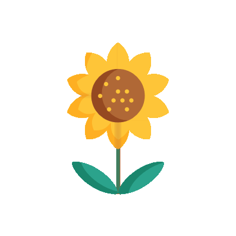
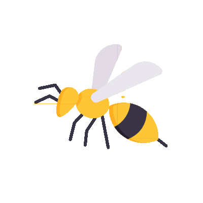
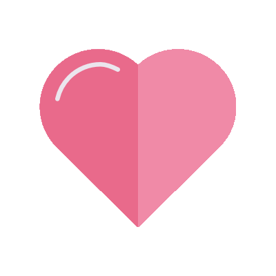

  

  

<h3 align="center">Hello, you!</h3>

<i>"I’m Nobody! Who are you? Are you – Nobody – too? Then there’s a pair of us! Don't tell! they'd advertise – you know!" - Emily Dickinson</i>

---

On paper, I'm a full-stack software engineer. That's how I make my bread; a little anorthodox considering my ancestors were actual bakers. When I'm not under capitalistic oath, I retreat into my garden and plant flowers. Currently, I'm busy paving paths around my garden so people can reach it.

If you'd like to be part of my garden, send me a buzzing bee. 

<h4>Garden? This is a code repository.</h4>

Oops, you caught me! Here's a list of things I like tinkering with right now.

- Artificial intelligence (applications in healthcare)

- Virtual reality environments and human-computer interaction (research)

- Microcontrollers and system architecture

- Music, art, literature, travel, sports (mens sana in corpore sano)

- Not gardening

---

<b>Honorable Mentions</b>

To my animals; **Cornelius** (cornsnake), **Lucifer** (ball python), **Mozart** (african lovebird), **Bono** (mini pinscher), **Stanija** (labrador), **Taz** (chihuahua), **Noah** (german shepherd), **Olga** (siberian husky), **Luna** (lop rabbit), **Iron Mike** (iguana).

